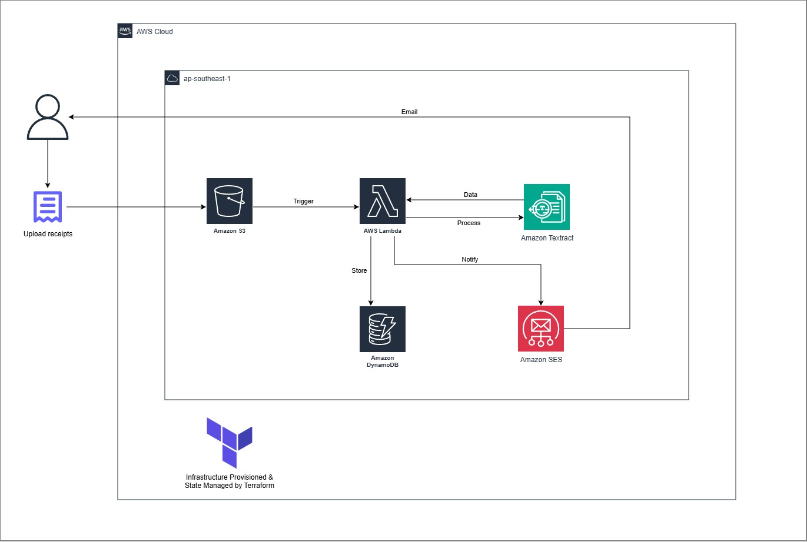
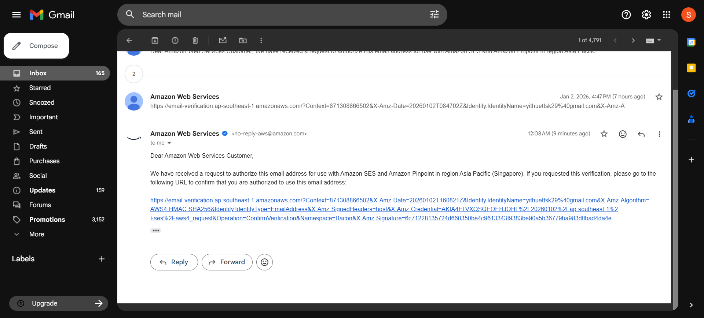
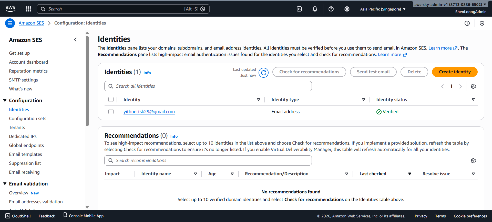
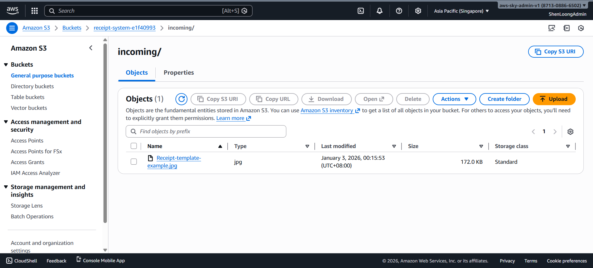
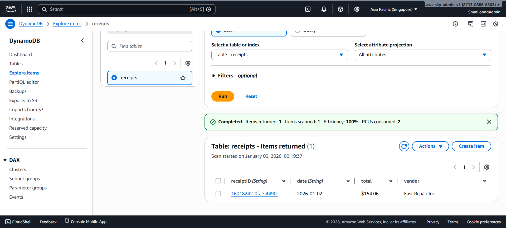
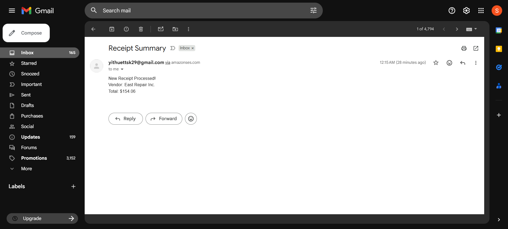
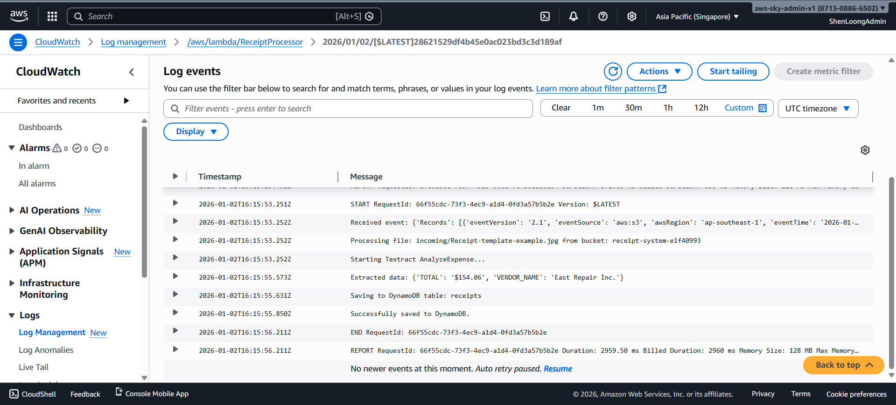

[![Contributors][contributors-shield]][contributors-url]
[![Forks][forks-shield]][forks-url]
[![Stargazers][stars-shield]][stars-url]
[![Issues][issues-shield]][issues-url]
[![Unlicense License][license-shield]][license-url]
[![LinkedIn][linkedin-shield]][linkedin-url]

  <h1 align="center">📑 Serverless Receipt Processor</h1>
  

     
    <strong>Automated AI-Powered Receipt Data Extraction & Archiving</strong>
     
    <a href="#about-the-project"><strong>Explore the docs »</strong></a>
  

  
Table of Contents

  <ol>
    <li><a href="#about-the-project">About The Project</a></li>
    <li><a href="#built-with">Built With</a></li>
    <li><a href="#use-cases">Use Cases</a></li>
    <li><a href="#architecture">Architecture</a></li>
    <li><a href="#file-structure">File Structure</a></li>
    <li><a href="#getting-started">Getting Started</a></li>
    <li><a href="#usage">Usage & Testing</a></li>
    <li><a href="#roadmap">Roadmap</a></li>
    <li><a href="#challenges">Challenges</a></li>
    <li><a href="#cost-optimization">Cost Optimization</a></li>
  </ol>

<h2 id="about-the-project">About The Project</h2>

  The <strong>Serverless Receipt Processor</strong> is an intelligent document processing pipeline that automates the tedious task of manual expense logging. By simply dropping a receipt image into an S3 bucket, the system leverages OCR and Machine Learning to extract key metadata—such as vendor name, date, and total amount—storing the results in a NoSQL database and notifying the user via email.

  This project demonstrates a <strong>fully automated CI/CD infrastructure</strong> approach where every component (S3, Lambda, DynamoDB, SES, IAM, and CloudWatch) is provisioned dynamically using <strong>Terraform</strong>, ensuring zero-manual configuration in the AWS Console.

<a href="#readme-top">↑ Back to Top</a>

<h2 id="built-with">Built With</h2>

  
  
  
  
  
  

<ul>
  <li><strong>Python 3.13:</strong> The latest stable Lambda runtime utilizing Boto3 for AWS SDK integrations.</li>
  <li><strong>Terraform:</strong> Used for Infrastructure as Code (IaC) with dynamic resource linking and circular-dependency protection.</li>
  <li><strong>AWS SES:</strong> Transactional email service for instant processing summaries.</li>
  <li><strong>Amazon Textract (AnalyzeExpense):</strong> Specialized ML models to extract structured receipt data without manual templates.</li>
  <li><strong>Amazon DynamoDB:</strong> Scalable NoSQL storage for structured receipt metadata.</li>
</ul>

<a href="#readme-top">↑ Back to Top</a>

<h2 id="use-cases">Use Cases</h2>
<ul>
  <li><strong>Personal Expense Tracking:</strong> Automatically log grocery and retail receipts into a digital ledger.</li>
  <li><strong>Automated Bookkeeping:</strong> Small business owners can bulk-upload receipts to generate monthly expense reports.</li>
  <li><strong>Tax Compliance:</strong> Maintain a searchable, permanent database of all business-related expenditures.</li>
</ul>

<a href="#readme-top">↑ Back to Top</a>

<h2 id="architecture">Architecture</h2>

<ol>
  <li><strong>Trigger:</strong> User uploads an image/PDF to the <code>incoming/</code> prefix in S3.</li>
  <li><strong>Processing:</strong> S3 event notification triggers the <strong>Python 3.13 Lambda</strong>.</li>
  <li><strong>Analysis:</strong> Lambda sends the document to <strong>Amazon Textract</strong> for specialized expense extraction.</li>
  <li><strong>Storage:</strong> Extracted vendor, date, and total amount are saved into <strong>DynamoDB</strong> with a unique UUID.</li>
  <li><strong>Notification:</strong> <strong>Amazon SES</strong> sends a summary email to the verified administrator address.</li>
  <li><strong>Monitoring:</strong> <strong>CloudWatch Logs</strong> (managed by Terraform) track every execution step.</li>
</ol>

<a href="#readme-top">↑ Back to Top</a>

<h2 id="file-structure">File Structure</h2>
<pre>AWS-TERRAFORM-RECEIPT-PROCESSOR/
├── .terraform/                  # Terraform managed internal directory
├── assets/                      # Project documentation assets (diagrams, images)
├── receipts/                    # Local folder for sample receipt images for testing
├── src/                         # Lambda backend logic
│   ├── lambda_function.py       # Python logic for Textract, DynamoDB, and SES
│   └── lambda_function.zip      # Deployment package generated by Terraform
├── .gitignore                   # Specified files and folders to ignore in Git
├── .terraform.lock.hcl          # Provider dependency lock file
├── iam.tf                       # Identity and Access Management roles and policies
├── main.tf                      # Primary infrastructure (S3, Lambda, DynamoDB, SES)
├── outputs.tf                   # Definitions for bucket names and resource ARNs
├── README.md                    # Project documentation and setup instructions
├── terraform.tf                 # Terraform settings and provider requirements
├── terraform.tfstate            # Current state of deployed infrastructure
├── terraform.tfstate.backup     # Previous state version for recovery
└── variables.tf                 # Variable declarations (Region, User Email)
</pre>

<a href="#readme-top">↑ Back to Top</a>

<h2 id="getting-started">Getting Started</h2>
<h3>Prerequisites</h3>
<ul>
  <li>AWS CLI configured with Admin permissions.</li>
  <li>Terraform CLI installed.</li>
  <li><strong>Set your AWS Region:</strong> Set to whatever <code>aws_region</code> you want in <code>variables.tf</code>.</li>
</ul>

<h3>Terraform State Management</h3>

Select one:

<ol>
   <li>Terraform Cloud</li>
   <li>Terraform Local CLI</li>
</ol>

<h4>Terraform Cloud Configuration</h4>

If you choose Terraform Cloud, please follow the steps below:

<ol>
   <li>Create a new <strong>Workspace</strong> in Terraform Cloud.</li>
   <li>In the Variables tab, add the following <strong>Terraform Variables:</strong>
   </li>
   <li>
    Add the following <strong>Environment Variables</strong> (AWS Credentials):
    <ul>
      <li><code>AWS_ACCESS_KEY_ID</code></li>
      <li><code>AWS_SECRET_ACCESS_KEY</code></li>
   </ul>
   </li>
</ol>

<h4>Terraform Local CLI Configuration</h4>

If you choose Terraform Local CLI, please follow the steps below:

<ol>
   <li>
      Comment the <code>backend</code> block in <code>terraform.tf</code>:
      <pre># backend "remote" {
#   hostname     = "app.terraform.io"
#   organization = "&lt;your-terraform-organization-name&gt;"
#   workspaces {
#     name = "&lt;your-terraform-workspace-name&gt;"
#   }
# }</pre>
   </li>
   <li>
    Add the following <strong>Environment Variables</strong> (AWS Credentials):
    <pre>git bash command:
export AWS_ACCESS_KEY_ID=&lt;your-aws-access-key-id&gt;
export AWS_SECRET_ACCESS_KEY=&lt;your-aws-secret-access-key&gt;
</ol>

<h3>Deployment</h3>
<ol>
  <li>Set your email address as an environment variable (Required for SES):
    <pre>Terraform Local: enter git bash command below
export TF_VAR_user_email=&lt;your-email@example.com&gt;
Terraform Cloud: 
Configure TF_VAR_user_email environment variables in workspace</pre>
  </li>
  <li>
    <strong>Clone the Repository</strong>
    </li>
    <li>
        <strong>Provision Infrastructure:</strong>
        <ul>
            <li>
            <strong>Terraform Cloud</strong> → <strong>Initialize & Apply:</strong> Push your code to GitHub. Terraform Cloud will automatically detect the change, run a <code>plan</code>, and wait for your approval.
            </li>
            <li>
            <strong>Terraform CLI</strong> → <strong>Initialize & Apply:</strong> Run <code>terraform init</code> → <code>terraform plan</code> → <code>terraform apply</code>, and wait for your approval.
            </li>
        </ul>
    </li>
  <li>
    <strong>Critical:</strong> Check your inbox for the "AWS Notification - Identity Verification" email and click the confirmation link
     
    
  </li>
</ol>

<a href="#readme-top">↑ Back to Top</a>

<h2 id="usage">Usage & Testing</h2>
<ul>
  <li>
    Upload a receipt file (JPG/PNG) using the AWS CLI to trigger the system: 
    <pre><code>aws s3 cp &lt;your-receipt-image&gt; s3://&lt;your-bucket-name&gt;/incoming/</code></pre>
    
  </li>
  <li>
    <strong>Verify Database:</strong> Check the DynamoDB console for a new entry. 
    
  </li>
  <li>
    <strong>Verify Email:</strong> You will receive an email summary of the extracted data (Check inbox or spam section). 
    
  </li>
  <li>
    <strong>Verify Logs:</strong> <code>terraform validate</code> ensures log groups are managed under <code>/aws/lambda/ReceiptProcessor</code>. 
    
  </li>
</ul>

<a href="#readme-top">↑ Back to Top</a>

<h2 id="roadmap">Roadmap</h2>
<ul>
  <li>[x] <strong>Python 3.13 Migration:</strong> Upgraded from 3.9 for longevity and performance.</li>
  <li>[x] <strong>Auto-Naming:</strong> Used <code>random_id</code> for globally unique S3 buckets.</li>
  <li>[ ] <strong>PDF Support:</strong> Enhance Textract logic to handle multi-page PDF documents.</li>
  <li>[ ] <strong>Web Dashboard:</strong> Build a React frontend to visualize receipts from DynamoDB.</li>
</ul>

<a href="#readme-top">↑ Back to Top</a>

<h2 id="challenges">Challenges</h2>
<table>
  <thead>
    <tr>
      <th>Challenge</th>
      <th>Solution</th>
    </tr>
  </thead>
  <tbody>
    <tr>
      <td><strong>Circular Dependencies</strong></td>
      <td>Resolved "Cycle" errors by using <code>locals</code> for function names instead of direct resource references in Log Groups.</td>
    </tr>
    <tr>
      <td><strong>Empty Bucket Deletion</strong></td>
      <td>Implemented <code>force_destroy = true</code> to allow Terraform to clean up S3 buckets even if they contain receipt images.</td>
    </tr>
    <tr>
      <td><strong>Silent Failures</strong></td>
      <td>Added explicit <code>print()</code> statements to Python logic to ensure visibility in CloudWatch Logs during Textract calls.</td>
    </tr>
  </tbody>
</table>

<a href="#readme-top">↑ Back to Top</a>

<h2 id="cost-optimization">Cost Optimization</h2>
<ul>
  <li><strong>Free Tier Alignment:</strong> Uses DynamoDB On-Demand and Lambda's free million requests.</li>
  <li><strong>Log Expiration:</strong> Logs are set to 7-day retention in <code>aws_cloudwatch_log_group</code> to prevent infinite storage growth.</li>
  <li><strong>Pay-as-you-go Textract:</strong> Only incur costs when a receipt is actually uploaded.</li>
</ul>

<a href="#readme-top">↑ Back to Top</a>

[contributors-shield]: https://img.shields.io/github/contributors/ShenLoong99/aws-terraform-receipt-processor-automation.svg?style=for-the-badge
[contributors-url]: https://github.com/ShenLoong99/aws-terraform-receipt-processor-automation/graphs/contributors
[forks-shield]: https://img.shields.io/github/forks/ShenLoong99/aws-terraform-receipt-processor-automation.svg?style=for-the-badge
[forks-url]: https://github.com/ShenLoong99/aws-terraform-receipt-processor-automation/network/members
[stars-shield]: https://img.shields.io/github/stars/ShenLoong99/aws-terraform-receipt-processor-automation.svg?style=for-the-badge
[stars-url]: https://github.com/ShenLoong99/aws-terraform-receipt-processor-automation/stargazers
[issues-shield]: https://img.shields.io/github/issues/ShenLoong99/aws-terraform-receipt-processor-automation.svg?style=for-the-badge
[issues-url]: https://github.com/ShenLoong99/aws-terraform-receipt-processor-automation/issues
[license-shield]: https://img.shields.io/github/license/ShenLoong99/aws-terraform-receipt-processor-automation.svg?style=for-the-badge
[license-url]: https://github.com/ShenLoong99/aws-terraform-receipt-processor-automation/blob/master/LICENSE.txt
[linkedin-shield]: https://img.shields.io/badge/-LinkedIn-black.svg?style=for-the-badge&logo=linkedin&colorB=555
[linkedin-url]: https://linkedin.com/in/si-kai-tan