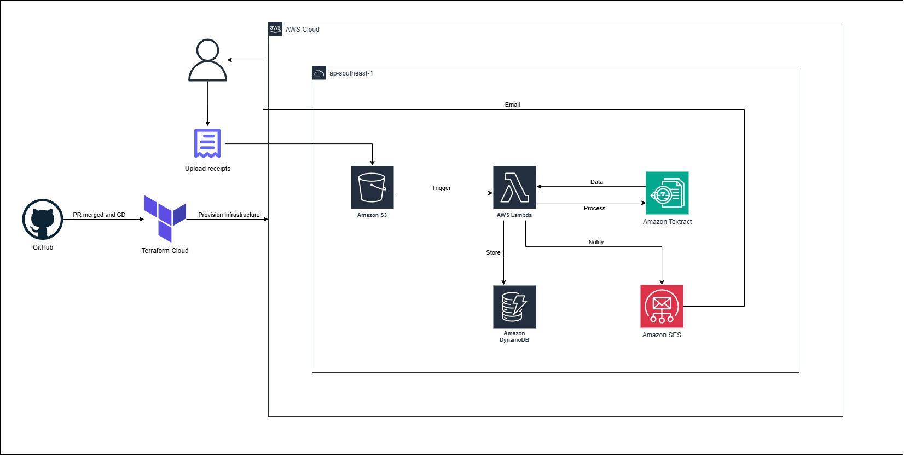
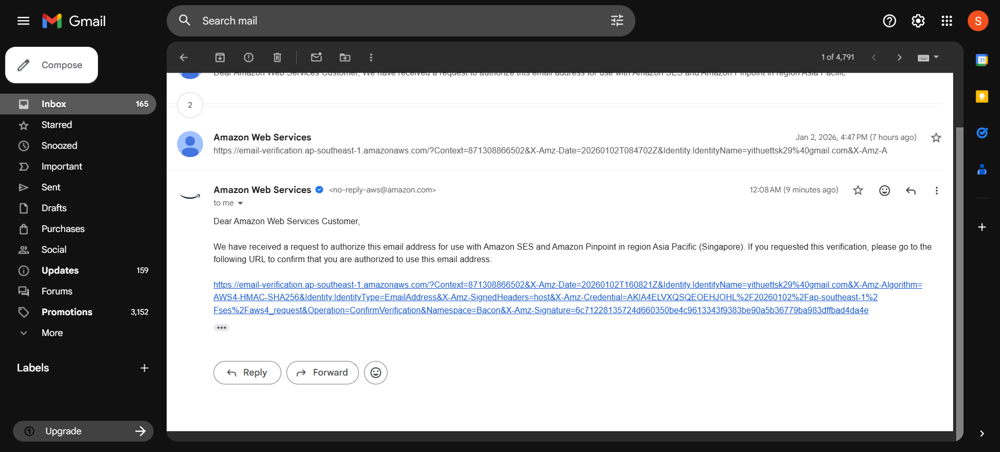
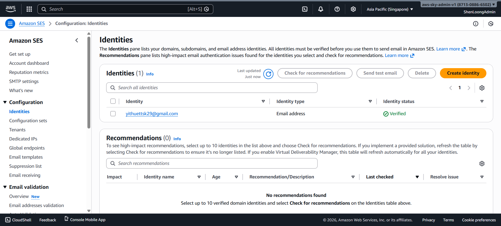
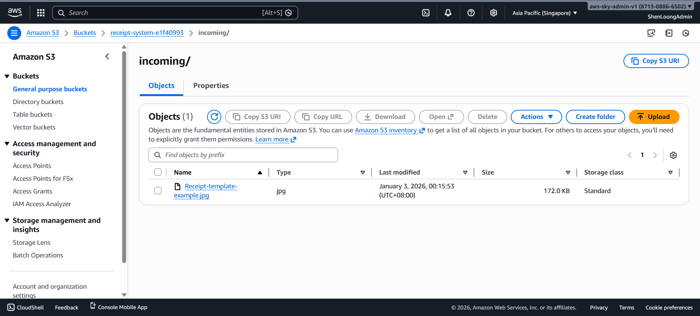
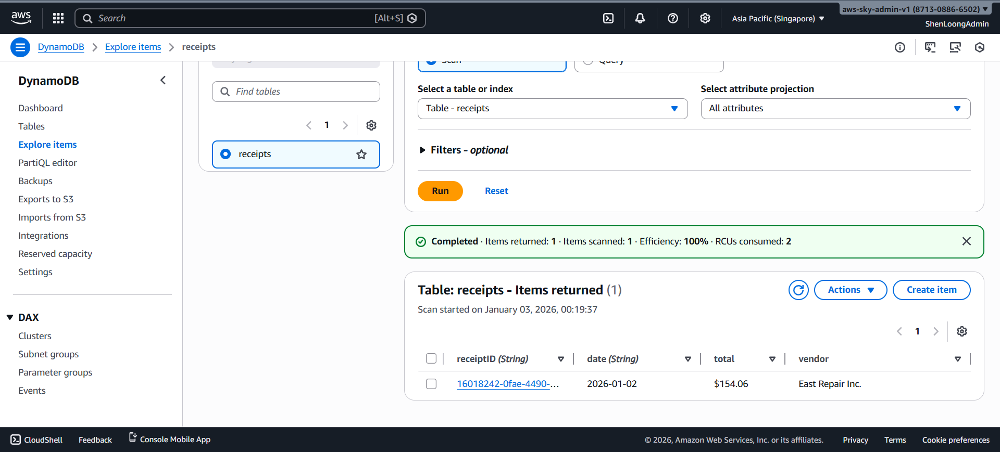
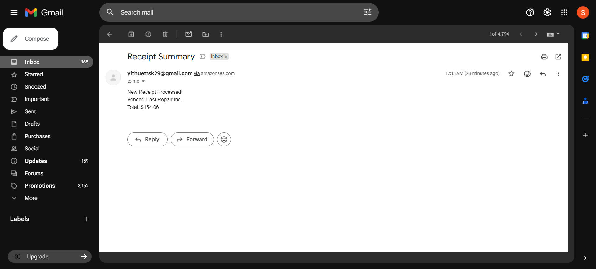
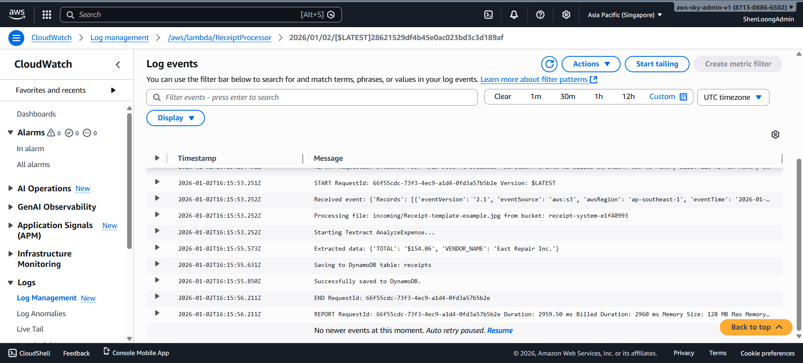

[![Contributors][contributors-shield]][contributors-url]
[![Forks][forks-shield]][forks-url]
[![Stargazers][stars-shield]][stars-url]
[![Issues][issues-shield]][issues-url]
[![Unlicense License][license-shield]][license-url]
[![LinkedIn][linkedin-shield]][linkedin-url]

  <h1>📑 Serverless Receipt Processor</h1>
  
  
Automated AI-Powered Receipt Data Extraction & Archiving

 

 
[![Infrastructure CI][ci-shield]][ci-url]
[![Production Deployment][cd-shield]][cd-url]
[![Update Documentation][docs-shield]][docs-url]

 

<a href="#about-the-project"><strong>Explore the docs »</strong></a>

  
Table of Contents

  <ol>
    <li><a href="#about-the-project">About The Project</a></li>
    <li><a href="#built-with">Built With</a></li>
    <li><a href="#use-cases">Use Cases</a></li>
    <li><a href="#architecture">Architecture</a></li>
    <li><a href="#file-structure">File Structure</a></li>
    <li><a href="#technical">Technical Reference</a></li>
    <li><a href="#getting-started">Getting Started</a></li>
    <li><a href="#gitops">GitOps & CI/CD Workflow</a></li>
    <li><a href="#usage">Usage</a></li>
    <li><a href="#roadmap">Roadmap</a></li>
    <li><a href="#challenges-faced">Challenges</a></li>
    <li><a href="#well-architected">Well Architected Framework</a></li>
    <li><a href="#acknowledgements">Acknowledgements</a></li>
  </ol>

<h2 id="about-the-project">About The Project</h2>

  The <strong>Serverless Receipt Processor</strong> is an intelligent document processing pipeline that automates the tedious task of manual expense logging. By simply dropping a receipt image into an S3 bucket, the system leverages OCR and Machine Learning to extract key metadata—such as vendor name, date, and total amount—storing the results in a NoSQL database and notifying the user via email.

  This project demonstrates a <strong>fully automated CI/CD infrastructure</strong> approach where every component (S3, Lambda, DynamoDB, SES, IAM, and CloudWatch) is provisioned dynamically using <strong>Terraform</strong>, ensuring zero-manual configuration in the AWS Console.

<a href="#readme-top">↑ Back to Top</a>

<h2 id="built-with">Built With</h2>

  
  
  
  
  
  

<ul>
  <li><strong>Python 3.13:</strong> The latest stable Lambda runtime utilizing Boto3 for AWS SDK integrations.</li>
  <li><strong>Terraform:</strong> Used for Infrastructure as Code (IaC) with dynamic resource linking and circular-dependency protection.</li>
  <li><strong>AWS SES:</strong> Transactional email service for instant processing summaries.</li>
  <li><strong>Amazon Textract (AnalyzeExpense):</strong> Specialized ML models to extract structured receipt data without manual templates.</li>
  <li><strong>Amazon DynamoDB:</strong> Scalable NoSQL storage for structured receipt metadata.</li>
</ul>

<a href="#readme-top">↑ Back to Top</a>

<h2 id="use-cases">Use Cases</h2>
<ul>
  <li><strong>Personal Expense Tracking:</strong> Automatically log grocery and retail receipts into a digital ledger.</li>
  <li><strong>Automated Bookkeeping:</strong> Small business owners can bulk-upload receipts to generate monthly expense reports.</li>
  <li><strong>Tax Compliance:</strong> Maintain a searchable, permanent database of all business-related expenditures.</li>
</ul>

<a href="#readme-top">↑ Back to Top</a>

<h2 id="architecture">Architecture</h2>

<ol>
  <li><strong>Trigger:</strong> User uploads an image/PDF to the <code>incoming/</code> prefix in S3.</li>
  <li><strong>Processing:</strong> S3 event notification triggers the <strong>Python 3.13 Lambda</strong>.</li>
  <li><strong>Analysis:</strong> Lambda sends the document to <strong>Amazon Textract</strong> for specialized expense extraction.</li>
  <li><strong>Storage:</strong> Extracted vendor, date, and total amount are saved into <strong>DynamoDB</strong> with a unique UUID.</li>
  <li><strong>Notification:</strong> <strong>Amazon SES</strong> sends a summary email to the verified administrator address.</li>
  <li><strong>Monitoring:</strong> <strong>CloudWatch Logs</strong> (managed by Terraform) track every execution step.</li>
</ol>

<a href="#readme-top">↑ Back to Top</a>

<h2 id="file-structure">File Structure</h2>

<pre>AWS-TERRAFORM-RECEIPT-PROCESSOR/
├── .terraform/                  # Terraform managed internal directory
├── .github/workflows/
│   └── cd.yml                   # Production GitHub Actions pipeline
│   └── ci.yml                   # Integration GitHub Actions pipeline
│   └── documentation.yml        # Documentation GitHub Actions pipeline
├── modules/                     # Modularized infrastructure components
│   ├── database/                # DynamoDB resources
│   │   ├── main.tf
│   │   ├── outputs.tf
│   │   └── variables.tf
│   ├── lambda/                  # Lambda logic and IAM roles
│   │   ├── src/
│   │   │   ├── lambda_function.py   # Core Python processing logic
│   │   │   └── lambda_function.zip  # Generated deployment package
│   │   ├── main.tf
│   │   ├── outputs.tf
│   │   └── variables.tf
│   └── storage/                 # S3 bucket and lifecycle configurations
│       ├── main.tf
│       ├── outputs.tf
│       └── variables.tf
├── scripts/                     # CD bash scripts (health-check, etc.)
│   ├── health-check.sh
│   └── integration-test.sh
├── assets/                      # Project documentation assets (diagrams, images)
├── .gitignore                   # Specified files and folders to ignore in Git
├── .terraform.lock.hcl          # Provider dependency lock file
├── .pre-commit-config.yaml      # Local git-hook orchestration
├── .tflint.hcl                  # TFLint AWS ruleset configuration
├── .checkov.yml                 # Checkov scan ignore list
├── .terraform-docs.yml          # Config for terraform documentation during workflow
├── main.tf                      # Root module: orchestrates the modules
├── outputs.tf                   # Aggregated outputs from modules
├── variables.tf                 # Global variables (Region, Email)
├── providers.tf                 # Terraform & Provider requirements
├── terraform.tfstate            # Current state of deployed infrastructure
├── terraform.tfstate.backup     # Previous state version for recovery
├── .gitignore                   # Standard Git exclusion list
└── README.md                    # Project documentation
</pre>

<a href="#readme-top">↑ Back to Top</a>

<h2 id="technical">Technical Reference</h2>
This section is automatically updated with the latest infrastructure details.

<b>Detailed Infrastructure Specifications</b>

<!-- BEGIN_TF_DOCS -->

## Requirements

| Name                                                                     | Version  |
| ------------------------------------------------------------------------ | -------- |
|  [terraform](#requirement_terraform) | >= 1.5.0 |
|  [aws](#requirement_aws)                   | ~> 5.0   |
|  [random](#requirement_random)          | ~> 3.0   |

## Modules

| Name                                                        | Source             | Version |
| ----------------------------------------------------------- | ------------------ | ------- |
|  [database](#module_database) | ./modules/database | n/a     |
|  [lambda](#module_lambda)       | ./modules/lambda   | n/a     |
|  [storage](#module_storage)    | ./modules/storage  | n/a     |

## Resources

No resources.

## Inputs

| Name                                                               | Description                                      | Type     | Default              | Required |
| ------------------------------------------------------------------ | ------------------------------------------------ | -------- | -------------------- | :------: |
|  [aws_region](#input_aws_region)    | The AWS region to deploy resources in            | `string` | `"us-east-1"`        |    no    |
|  [lambda_name](#input_lambda_name) | Name for the Lambda function                     | `string` | `"ReceiptProcessor"` |    no    |
|  [user_email](#input_user_email)    | The verified email for SES sending and receiving | `string` | n/a                  |   yes    |

## Outputs

| Name                                                                                            | Description                             |
| ----------------------------------------------------------------------------------------------- | --------------------------------------- |
|  [bucket_id](#output_bucket_id)                                  | The ID of the S3 bucket created         |
|  [dynamodb_table_name](#output_dynamodb_table_name)    | The name of the DynamoDB table          |
|  [lambda_function_name](#output_lambda_function_name) | The name of the Lambda function created |
|  [region](#output_region)                                           | The AWS region being used               |

<!-- END_TF_DOCS -->

<a href="#readme-top">↑ Back to Top</a>

<h2 id="getting-started">Getting Started</h2>
<h3>Prerequisites</h3>
<ul>
  <li>AWS CLI configured with Admin permissions.</li>
  <li>Terraform CLI (v1.5.0+) installed locally.</li>
  <li>Terraform Cloud account for remote state management.</li>
  <li><strong>Set your AWS Region:</strong> Set to whatever <code>aws_region</code> you want in <code>variables.tf</code>.</li>
</ul>

<h3>Terraform Cloud State Management</h3>
<ol>
   <li>Create a new <strong>Workspace</strong> with github version control workflow in Terraform Cloud.</li>
   <li>In the Variables tab, add the following <strong>Terraform Variables:</strong>
   </li>
   <li>
    Add the following <strong>Environment Variables</strong> (AWS Credentials):
    <ul>
      <li><code>AWS_ACCESS_KEY_ID</code></li>
      <li><code>AWS_SECRET_ACCESS_KEY</code></li>
   </ul>
   </li>
    <li>
      Run the command ni Terraform CLI:
      <pre>terraform login</pre>
    </li>
    <li>Create a token and follow the steps in browser to complete the Terraform Cloud Connection.</li>
    <li>
      Add the <code>backend</code> block in <code>terraform</code> code block</code>:
    <pre>backend "remote" {
  hostname     = "app.terraform.io"
  organization = &lt;your-organization-name&gt;
  workspaces {
    name = &lt;your-workspace-name&gt;
  }
}</pre>
   </li>
    <li>
      Run the command in Terraform CLI to migrate the state into Terraform Cloud:
      <pre>terraform init -migrate-state</pre>
    </li>
</ol>

<h3>Installation & Deployment</h3>
<ol>
    <li>
        <strong>Clone the Repository:</strong>
        <pre>git clone https://github.com/ShenLoong99/aws-terraform-receipt-processor-automation.git</pre>
    </li>
    <li>
        <strong>Provision Infrastructure:</strong> 
        <strong>Terraform Cloud</strong> → <strong>Initialize & Apply:</strong> Push your code to GitHub. Terraform Cloud will automatically detect the change, run a <code>plan</code>, and wait for your approval.
    </li>
    <li>
        <strong>Observe workflow:</strong> 
        <strong>GitHub (GitOps)</strong> → <strong>Github actions:</strong> Observe the process/workflow of CI/CD in the actions tab in GitHub.
    </li>
    <li>
      <strong>Critical:</strong> Check your inbox for the "AWS Notification - Identity Verification" email and click the confirmation link
       
      
    </li>
</ol>

<a href="#readme-top">↑ Back to Top</a>

<h2 id="gitops">GitOps & CI/CD Workflow</h2>

This project uses a fully automated GitOps pipeline to ensure code quality and deployment reliability. The <strong>Pre-commit</strong> framework implements a "Shift-Left" strategy, ensuring that code is formatted, documented, and secure before it ever leaves your machine.

<h3>Workflow</h3>
<ol>
  <li>
    <strong>Branch Protection Rulesets</strong> 
    To ensure high code quality and prevent unauthorized changes to the production environment, the <code>main</code> branch is governed by a <strong>GitHub Branch Ruleset</strong>.
    <ul>
      <li><strong>Pull Request Mandatory:</strong> No code can be pushed directly to <code>main</code>. All changes must originate from a feature branch and be merged via a Pull Request.</li>
      <li><strong>Required Status Checks:</strong> The <code>Infrastructure CI</code> (Terraform Plan & Static Analysis) must pass successfully before a merge is permitted.</li>
      <li><strong>Bypass Authority:</strong> The dedicated GitHub App is added to the Bypass List with "Always allow" permissions. This allows the bot to push documentation updates directly to <code>main</code> without being blocked by PR requirements.</li>
    </ul>
  </li>
  <li>
    <strong>Pre-commit</strong>
    <ul>
      <li><strong>Tool:</strong> Executes <code>terraform fmt</code>, <code>terraform validate</code>, <code>TFLint</code>, <code>terraform_docs</code> and <code>checkov</code> to ensure the code is clean.</li>
      <li><strong>Trigger:</strong> Runs on every <strong>git commit</strong>.</li>
      <li>
        <strong>Outcome:</strong> If any check fails, the commit is blocked. You fix the error, re-add the file, and commit again.
      </li>
    </ul>
  </li>
  <li>
    <strong>Continuous Integration (PR)</strong>
    <ul>
      <li><strong>Tool:</strong> Executes <code>terraform fmt -check</code>, <code>terraform validate</code> and <code>checkov</code>, then do <code>plan</code> and cost estimation and print it on PR.</li>
      <li><strong>Trigger:</strong> Runs on every <strong>Pull Request</strong>.</li>
      <li>
        <strong>Outcome:</strong> This acts as the "Gatekeeper" before code is merged to <code>main</code>.
      </li>
    </ul>
  </li>
  <li>
    <strong>Continuous Delivery (Deployment)</strong>
    <ul>
      <li><strong>Tool:</strong> Terraform Cloud + GitHub Actions OIDC.</li>
      <li><strong>Trigger:</strong> Merges to the <code>main</code> branch.</li>
      <li>
        <strong>Outcome:</strong> The pipeline verifies the infrastructure state and runs a post-deployment health check with(<code>health-check.sh</code> & <code>smoke-test-website.sh</code>).
      </li>
    </ul>
  </li>
  <li>
    <strong>Dynamically update readme documentation</strong>
    <ul>
      <li><strong>Tool:</strong> <code>terraform_docs</code> + GitHub Actions.</li>
      <li><strong>Trigger:</strong> Merges to the <code>main</code> branch.</li>
      <li>
        <strong>Outcome:</strong> The pipeline verifies the infrastructure state from Terraform Cloud, retrieve outputs from Terraform Cloud and update the readme documentation file dynamically.
      </li>
    </ul>
  </li>
</ol>

<h3>Prerequisites for GitOps</h3>
<ul>
  <li><strong>Repository Secret <code>TF_API_TOKEN</code>:</strong> Required for GitHub to communicate with Terraform Cloud.</li>
  <li><strong>Trigger:</strong> A GitHub Actions OIDC role (<code>GitHubActionRole</code>) allows the runner to verify AWS resources without long-lived keys.</li>
  <li>
      <strong>Automated Documentation via GitHub App:</strong> Instead of using a Personal Access Token (PAT) or the default <code>GITHUB_TOKEN</code>, this project uses a custom <strong>GitHub App</strong> for automated tasks. 
      <table>
         <thead>
            <tr>
               <td>Secret</td>
               <td>Description</td>
               <td>Source</td>
            </tr>
         </thead>
         <tbody>
            <tr>
               <td><code>BOT_APP_ID</code></td>
               <td>The unique numerical ID assigned to your GitHub App.</td>
               <td>App Settings > General</td>
            </tr>
            <tr>
               <td><code>BOT_PRIVATE_KEY</code></td>
               <td>The full content of the generated <code>.pem</code> private key file.</td>
               <td>App Settings > Private keys</td>
            </tr>
         </tbody>
      </table>
   </li>
</ul>

<a href="#readme-top">↑ Back to Top</a>

<h2 id="usage">Usage & Testing</h2>
<ul>
  <li>
    Upload a receipt file (JPG/PNG) using the AWS CLI to trigger the system: 
    <pre><code>aws s3 cp &lt;your-receipt-image&gt; s3://&lt;your-bucket-name&gt;/incoming/</code></pre>
    
  </li>
  <li>
    <strong>Verify Database:</strong> Check the DynamoDB console for a new entry. 
    
  </li>
  <li>
    <strong>Verify Email:</strong> You will receive an email summary of the extracted data (Check inbox or spam section). 
    
  </li>
  <li>
    <strong>Verify Logs:</strong> <code>terraform validate</code> ensures log groups are managed under <code>/aws/lambda/ReceiptProcessor</code>. 
    
  </li>
</ul>

<a href="#readme-top">↑ Back to Top</a>

<h2 id="roadmap">Roadmap</h2>
<ul>
  <li>[x] <strong>Python 3.13 Migration:</strong> Upgraded from 3.9 for longevity and performance.</li>
  <li>[x] <strong>Auto-Naming:</strong> Used <code>random_id</code> for globally unique S3 buckets.</li>
  <li>[ ] <strong>PDF Support:</strong> Enhance Textract logic to handle multi-page PDF documents.</li>
  <li>[ ] <strong>Web Dashboard:</strong> Build a React frontend to visualize receipts from DynamoDB.</li>
</ul>

<a href="#readme-top">↑ Back to Top</a>

<h2 id="challenges">Challenges</h2>
<table>
  <thead>
    <tr>
      <th>Challenge</th>
      <th>Solution</th>
    </tr>
  </thead>
  <tbody>
    <tr>
      <td><strong>Circular Dependencies</strong></td>
      <td>Resolved "Cycle" errors by using <code>locals</code> for function names instead of direct resource references in Log Groups.</td>
    </tr>
    <tr>
      <td><strong>Empty Bucket Deletion</strong></td>
      <td>Implemented <code>force_destroy = true</code> to allow Terraform to clean up S3 buckets even if they contain receipt images.</td>
    </tr>
    <tr>
      <td><strong>Silent Failures</strong></td>
      <td>Added explicit <code>print()</code> statements to Python logic to ensure visibility in CloudWatch Logs during Textract calls.</td>
    </tr>
  </tbody>
</table>

<a href="#readme-top">↑ Back to Top</a>

<h2 id="well-architected">AWS Well-Architected Framework Alignment</h2>

This project is designed with the six pillars of the AWS Well-Architected Framework in mind to ensure a secure, high-performing, resilient, and efficient infrastructure.

<ol>
  <li>
    <strong>Operational Excellence</strong>
    <ul>
      <li><strong>Infrastructure as Code (IaC):</strong> The entire environment is modularized and managed via Terraform, enabling version control, repeatability, and automated provisioning through Terraform Cloud.</li>
      <li><strong>Observability & Logging:</strong> Implemented structured CloudWatch logging with custom debug prints to monitor the health of Textract extractions and DynamoDB transactions.</li>
      <li><strong>Deployment Automation:</strong> A robust GitHub Actions CI/CD pipeline ensures consistent deployments with automated post-deployment health checks and integration probes.</li>
    </ul>
  </li>
  <li>
    <strong>Security</strong>
    <ul>
      <li><strong>Principle of Least Privilege:</strong> IAM roles are strictly scoped to specific resource ARNs (e.g., restricting SES permissions to a single verified identity and S3 access to the specific bucket).</li>
      <li><strong>Data Protection at Rest:</strong> The S3 bucket is configured with <code>AES256</code> server-side encryption by default and <code>public_access_block</code> to prevent unauthorized exposure.</li>
      <li><strong>Secure Infrastructure:</strong> SQS permissions are explicitly defined to allow the Lambda function to send failed events to the Dead Letter Queue without broad administrative access.</li>
    </ul>
  </li>
  <li>
    <strong>Reliability</strong>
    <ul>
      <li><strong>Fault Tolerance:</strong> Integrated an SQS Dead Letter Queue (DLQ) to capture and analyze failed processing events, preventing data loss during unexpected service interruptions.</li>
      <li><strong>Point-in-Time Recovery (PITR):</strong> DynamoDB is configured with PITR enabled, protecting the extracted receipt data against accidental deletion or code bugs.</li>
      <li><strong>Managed Service Resiliency:</strong> Utilizing AWS Lambda and Amazon Textract ensures the system scales and recovers automatically across multiple Availability Zones.</li>
    </ul>
  </li>
  <li>
    <strong>Performance Efficiency</strong>
    <ul>
      <li><strong>Serverless Scaling:</strong> The architecture scales horizontally and instantaneously from zero to peak demand, as AWS handles the compute scaling for Lambda and the throughput for Textract.</li>
      <li><strong>Optimized Memory:</strong> Lambda is configured with 512MB of RAM to balance execution speed and cost, ensuring faster processing of high-resolution receipt images.</li>
      <li><strong>Selection of Right Services:</strong> Used Amazon Textract’s specialized <code>AnalyzeExpense</code> API to offload complex OCR and document-to-data mapping, reducing the need for heavy custom ML code.</li>
    </ul>
  </li>
  <li>
    <strong>Cost Optimization</strong>
    <ul>
      <li><strong>Zero-Waste Cleanup:</strong> Implemented an S3 Lifecycle Rule to delete receipt images after 1 day (for demo purposes) and abort incomplete multipart uploads after 7 days to eliminate unnecessary storage costs.</li>
      <li><strong>Pay-as-you-go Model:</strong> Utilized DynamoDB <code>PAY_PER_REQUEST</code> and Lambda serverless compute to ensure the project costs are $0.00 when not in use.</li>
      <li><strong>Resource Tagging:</strong> Applied a centralized <code>common_tags</code> local map (Project, Environment, Owner) across all resources to enable granular cost tracking in the AWS Billing Dashboard.</li>
    </ul>
  </li>
  <li>
    <strong>Sustainability</strong>
    <ul>
      <li><strong>Minimizing Idle Resources:</strong> By choosing a fully serverless stack, the project minimizes the environmental impact by only consuming energy during the milliseconds required to process a receipt.</li>
      <li><strong>Managed Service Efficiency:</strong> Shifting hardware management to AWS allows the project to benefit from the high-occupancy and power-optimized data centers managed by the cloud provider.</li>
    </ul>
  </li>
</ol>

<a href="#readme-top">↑ Back to Top</a>

<h2 id="acknowledgements">Acknowledgements</h2>

  Special thanks to <strong>Tech with Lucy</strong> for the architectural inspiration and excellent AWS tutorials that helped shape this pipeline.

<ul>
  <li>
    See her youtube channel here: <a href="https://www.youtube.com/@TechwithLucy" target="_blank">Tech With Lucy</a>
  </li>
  <li>
    Watch her video here: <a href="https://www.youtube.com/watch?v=0hJxcBdRlYw" target="_blank">5 Intermediate AWS Cloud Projects To Get You Hired (2025)</a>
  </li>
</ul>

<a href="#readme-top">↑ Back to Top</a>

[contributors-shield]: https://img.shields.io/github/contributors/ShenLoong99/aws-terraform-receipt-processor-automation.svg?style=for-the-badge
[contributors-url]: https://github.com/ShenLoong99/aws-terraform-receipt-processor-automation/graphs/contributors
[forks-shield]: https://img.shields.io/github/forks/ShenLoong99/aws-terraform-receipt-processor-automation.svg?style=for-the-badge
[forks-url]: https://github.com/ShenLoong99/aws-terraform-receipt-processor-automation/network/members
[stars-shield]: https://img.shields.io/github/stars/ShenLoong99/aws-terraform-receipt-processor-automation.svg?style=for-the-badge
[stars-url]: https://github.com/ShenLoong99/aws-terraform-receipt-processor-automation/stargazers
[issues-shield]: https://img.shields.io/github/issues/ShenLoong99/aws-terraform-receipt-processor-automation.svg?style=for-the-badge
[issues-url]: https://github.com/ShenLoong99/aws-terraform-receipt-processor-automation/issues
[license-shield]: https://img.shields.io/github/license/ShenLoong99/aws-terraform-receipt-processor-automation.svg?style=for-the-badge
[license-url]: https://github.com/ShenLoong99/aws-terraform-receipt-processor-automation/blob/master/LICENSE.txt
[linkedin-shield]: https://img.shields.io/badge/-LinkedIn-black.svg?style=for-the-badge&logo=linkedin&colorB=555
[linkedin-url]: {{LINKEDIN_URL}}
[ci-shield]: https://github.com/ShenLoong99/aws-terraform-receipt-processor-automation/actions/workflows/ci.yml/badge.svg
[ci-url]: https://github.com/ShenLoong99/aws-terraform-receipt-processor-automation/actions/workflows/ci.yml
[cd-shield]: https://github.com/ShenLoong99/aws-terraform-receipt-processor-automation/actions/workflows/cd.yml/badge.svg
[cd-url]: https://github.com/ShenLoong99/aws-terraform-receipt-processor-automation/actions/workflows/cd.yml
[docs-shield]: https://github.com/ShenLoong99/aws-terraform-receipt-processor-automation/actions/workflows/documentation.yml/badge.svg
[docs-url]: https://github.com/ShenLoong99/aws-terraform-receipt-processor-automation/actions/workflows/documentation.yml
